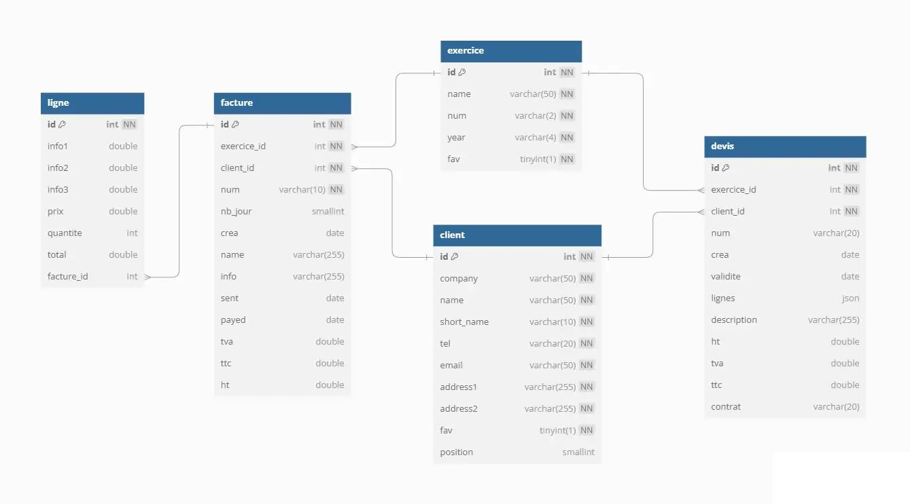
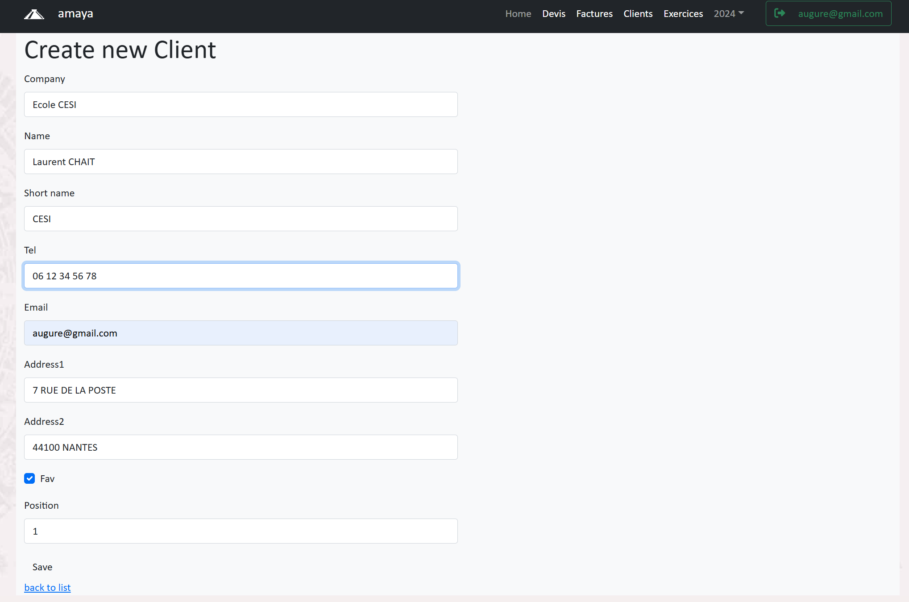
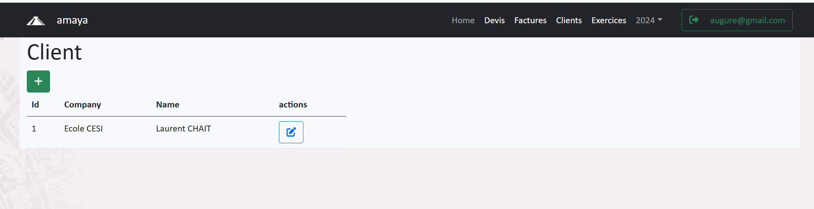
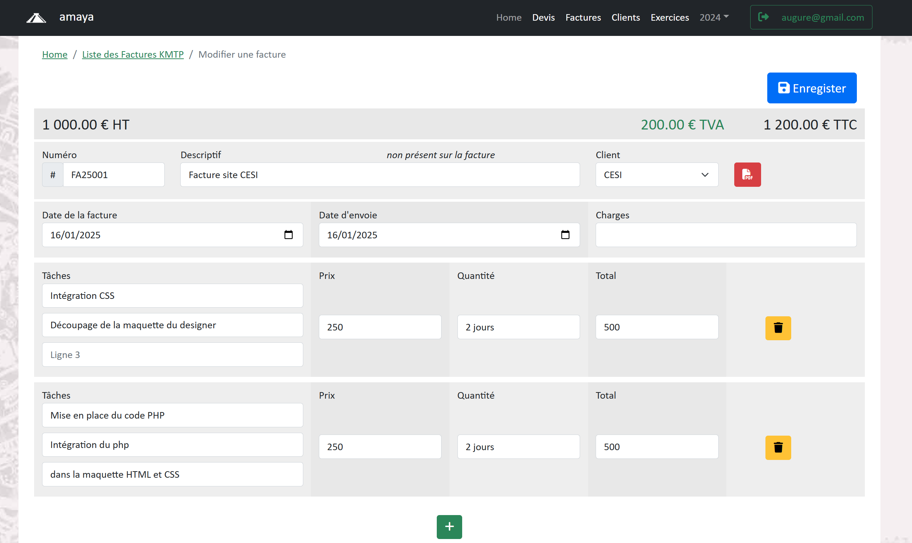
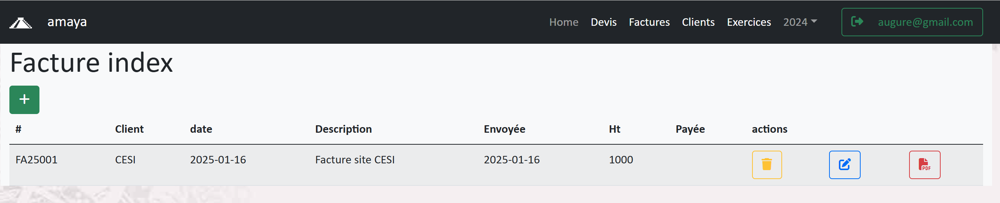

# Projet Amaya

# :one: Etape 1 Créer les Entity
- Client  
- Facture  
- Ligne 
   
Identifier les champs ou les attributs des Entity

Si possible faire un diagramme de classe sur umlet  
A l'aide du refactoring du SQL générer le modèle relationnel  

# La maquette :

Création d'un client  
  

Liste des clients  
  

Création d'une facture  
  

Liste des factures  
  
